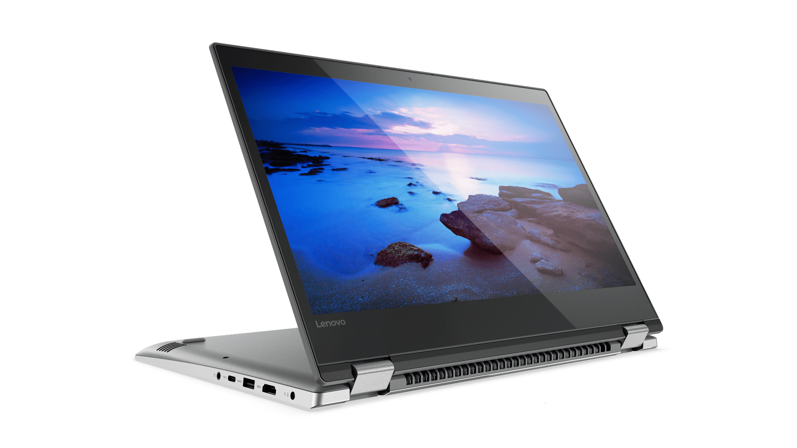

# Lenovo Yoga 520-14IKB (80YM) Opencore Hackintosh 

A guide for installing macOS Ventura 13.2.1 on Lenovo Yoga 520-14IKB using OpenCore 0.8.9 UEFI.

## Note 
I'm not an expert in hackintoshing, this is my first Hackintosh, I managed to get everything working in my laptop, your laptop may be different than mine, higher specifications, dedicated GPU, etc, it's not guaranteed to work a 100%, if it's so then this guide may not work for you, be careful and good luck!

## Laptop's Hardware 
- <b>CPU</b>: [Intel i5 7200U](https://ark.intel.com/content/www/us/en/ark/products/95443/intel-core-i5-7200u-processor-3m-cache-up-to-3-10-ghz.html) Dual-Core CPU (Kaby Lake-U)
- <b>GPU</b>: Intel HD 620 Graphics 
- <b>Storage</b>: 500Gb NVME Kingston (Upgraded)
- <b>RAM</b>: 8 GB DDR4 2133MHz
- <b>Screen</b>: 13.9-inch Full HD (1366 x 768)
- <b>Trackpad</b>: PS2 (I2C)
- <b>Wi-Fi</b>: Intel AC3150 Dual Band
- <b>Ports</b>: 1 x USB-C, 2 x USB 3.0, USB 2.0 SD Card Reader, HDMI Display Port
- <b>Ethernet</b> Dongle USB RD9700

## Overview 
This laptop is a reasonably spec laptop, I use it for development but I don't recommend it for gaming or video editing, the battery life is max 3 hours, it's good.

## What's Working?
- Intel HD 620 Graphics full QE/CI 
- CPU power management 
- Battery (Cycles doesn't show properly)
- All USB ports 
- HDMI port (including HDMI Audio)
- USB Dongle Ethernet
- Audio (including headphones jack)
- Wi-Fi & Bluetooth (including Apple services)
- Internal webcam with FaceTime
- Trackpad with GPIO mode (including gestures)
- Sleep (hibernation, lid sleep, and lid wake)
- Native macOS Hibernation
- Screen Brightness with Hotkeys
- Fn keys and Hotkeys lock
- FileVault Disk Encryption
- Tested on Monterey (require change AirportItlwm.kext) and Ventura

## What's Not Working?
- Apple Pay with TouchID, to confirm any purchases you need to type your password instead of using TouchID, more information [here](https://discussions.apple.com/thread/7808558)

## Bugs
- DRM support (iTunes Movies, Apple TV+, Amazon Prime and Netflix, and others) could be fixed in the future, more information [here](https://github.com/acidanthera/bugtracker/issues/586) and [here](https://www.tonymacx86.com/threads/an-idiots-guide-to-lilu-and-its-plug-ins.260063/#DRM).
- Not tested microphone using Google Chrome or Firefox, see https://github.com/Ab2774/Lenovo-IdeaPad-320-14-IKB-Hackintosh/issues/3.
- Screen light-up after wake require a second keyboard click with using battery, this can be fixed but it will break sleep causing an instant wake.

## Requirement 
- 16GB USB drive 
- macOS Ventura image downloaded from the Appstore 

## BIOS Configuration
Before doing anything, make sure to update your BIOS to the latest version
<b>Configuration</b>: `SATA Controller Mode` to `AHCI`.
<b>Security</b>: `Intel Platform Trust Technology`, `Intel SGX` and `Secure Boot` to `Disabled`.
<b>Boot</b>: `Boot Mode` to `UEFI`,`Fast Boot` to `Enabled`, `USB Boot` to `Enabled`.

## Installation
For a complete guide on how to create an installation disk on USB stick follow this [link](https://dortania.github.io/OpenCore-Install-Guide/installer-guide/mac-install.html)
After create disk, mount the EFI partition in your USB, Copy-and-paste the folder `EFI` from this release's repository and generate MacBookPro14,2 SMBIOS (which is the closest one to this laptop's hardware) and change it, copy to config.plist, reboot your laptop and press `F12` to enter `BIOS Menu`, choose your USB installer and select boot from the USB that shown, it may take some time to boot, after is done, you should see `macOS Utilities`, choose `Disk Utility` and erase the drive you want to install macOS on it, click on `Erase` and type the name that you want, like: "Mac OS", choose the format as `APFS` and `Scheme` as `GUID Partition Map` and click `Erase`, after it's done, close the window and go back to `macOS Utilities` and choose `Install macOS`, click `Agree` to accept the license agreement, the installation should starts now, your laptop should restarts several times, after it's done, login to your AppleID (for more specific guide please go [here](https://dortania.github.io/oc-laptop-guide/)), after setting up your laptop, unzip the folder.
If you have problems with sleep please go [here](https://dortania.github.io/oc-laptop-guide/battery-power-management/correcting-sleep-problems.html).
Restart, and you're ready to go!

## Extras (above Ventura)
- After you finish the installation you'll notice that your iMessage and other Apple services aren't working properly, to fix that issue you have to add `ROM`, `MLB` and a proper SMBIOS (which is MacBookPro14,2 for this device) in your `config.plist`, for more information follow this guide from [here](https://dortania.github.io/OpenCore-Post-Install/universal/iservices.html#fixing-imessage-and-other-services-with-opencore).
- If you don't like the name of your laptop that shown in "About This Mac", you can change it! Press Shift+Cmd+G <kbd>⇧⌘G</kbd> and copy-and-paste this path: `/Users/Username/Library/Preferences/com.apple.SystemProfiler.plist`, and remember, the word `Username` Is for your username, now download your favorite plist editor (mine is "PilstEdit Pro"), then you can change to `Lenovo Yoga 520-14IKB (80YM)` or any name you want.

- Fn keys don't work usually on most Hackintoshes, luckily, `YogaSMC` can fix this! Not just enabling Fn keys and their abilities, it enables Lenovo features like `Conversation Mode` to stop charging the battery at %60 to increase it's age, ture Cycle Count reading because macOS ones can be wrong, `Fn Mode` etc, to get those features, `YogaSMC` is included inside the EFIs, all you have to do is install `YogaSMCNC` app and `YogaSMCPane` from this [link](https://github.com/zhen-zen/YogaSMC/releases.
- The keyboard experience on this laptop is a bit different than a real mac, in order to make the closest to a real mac we need to make a couple of changes, luckily, in the latest `VoodooPS2` release, it automatically swaps <kbd>Cmd</kbd> to <kbd>Win</kbd>, if you want to reverse it, them in `System Preferences` as shown in the photo.

## Credits
- In special [Ab2774] (https://github.com/Ab2774/Lenovo-IdeaPad-320-14-IKB-Hackintosh.git) for EFI provided
- [Apple](https://www.apple.com) for macOS.
- [Acidanthera](https://github.com/acidanthera) for most of the Kexts.
- [RehabMan](https://github.com/RehabMan) for some ACPI patches.
- [Steve Zheng](https://github.com/stevezhengshiqi) for some ACPI patches.
- [zhen-zen](https://github.com/zhen-zen) for YogaSMC project.
- [0xFireWolf](https://github.com/0xFireWolf) for RealtekCardReader and RealtekCardReaderFriend Kexts, and various patches.
- [1Revenger1](https://github.com/1Revenger1) for ECEnabler Kext.
- [Sniki](https://github.com/Sniki) for some ACPI patches.
- [daliansky](https://github.com/daliansky) for some ACPI patches.
- [Moh_Ameen](https://github.com/ameenjuz) for some ACPI patches.
- [blackosx](https://github.com/blackosx/OpenCanopyIcons) for OpenCanopyIcons theme.
- And anyone else that helped to develop and improve hackintoshing.
